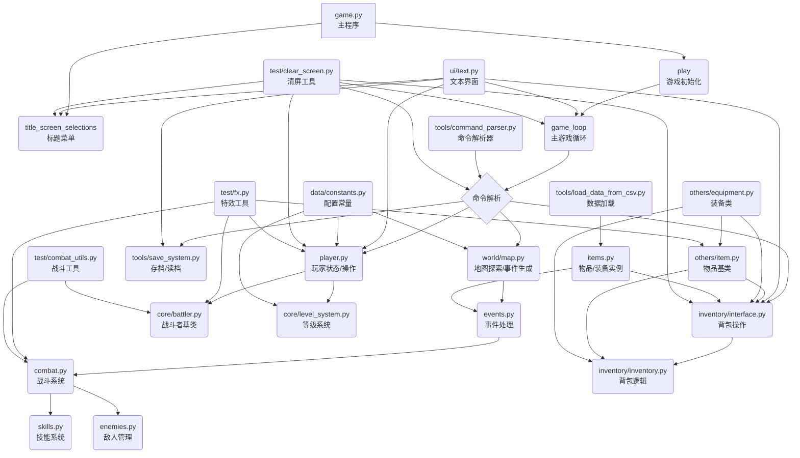

# Text RPG Game 综合说明文档撰写计划

## 1. 引言
*   简要介绍 `Text RPG Game` 项目。
*   文档目的和读者对象。

## 2. 项目概述与功能特性
*   项目简介（基于 Python 的文本 RPG 游戏框架）。
*   核心功能列表（回合制战斗、角色管理、技能系统、物品/装备、背包、地图探索、存档/读档）。
*   详细描述每个核心功能。

## 3. 技术架构
*   项目文件结构概览（使用文件列表和简要说明）。
*   主要模块及其职责（例如 `combat.py` 战斗逻辑，`player.py` 玩家管理，`world/map.py` 地图等）。
*   使用的主要技术/库（Python，rich，ascii_magic）。
*   数据存储方式（CSV, JSON, 存档文件）。

### 技术架构图

## 4. 安装与部署
*   环境要求（Python 版本，建议 3.12+）。
*   获取项目代码（Git 克隆）。
*   安装依赖（列出 `rich` 和 `ascii_magic`，说明如何使用 pip 安装）。
*   运行项目的主程序 (`python game.py`)。

## 5. 配置指南
*   介绍 [`data/constants.py`](data/constants.py) 文件中的可配置项。
*   详细说明每个配置项的作用（例如 `MONEY_MULTIPLIER`, `EXPERIENCE_RATE`, `DEBUG`, `QUALITY_CONFIG`, `ENEMY_VARIANTS` 等）。
*   如何修改配置。

## 6. 使用方法
*   游戏启动和主菜单介绍。
*   游戏流程（地图探索，随机事件）。
*   战斗系统操作指南（普通攻击、技能、防御、逃跑）。
*   背包系统操作指南（查看、使用、丢弃、装备物品）。
*   角色状态查看。
*   存档和读档操作。
*   其他可能的命令（根据 `tools/command_parser.py` 的内容）。

## 7. API 接口说明
*   说明本项目主要是一个命令行应用，没有对外暴露标准的 API 接口。
*   可以简要提及内部模块之间的交互方式（如果需要）。

## 8. 常见问题与故障排除
*   列出一些可能遇到的问题（例如依赖未安装、文件找不到等）。
*   提供相应的解决方案。
*   如何开启调试模式 (`DEBUG = True`) 以获取更多信息。

## 9. 贡献指南
*   如何贡献代码、提交 Issue 或 Pull Request（引用 [`README.md`](README.md) 中的信息）。

## 10. 许可证
*   说明项目的许可证信息（如果 [`README.md`](README.md) 或其他地方有提及）。