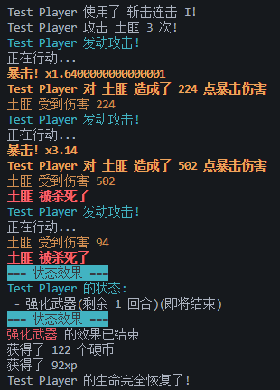
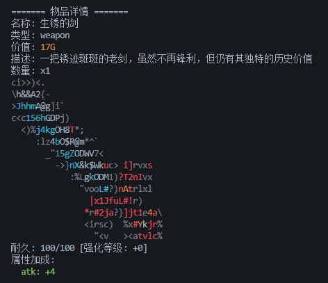
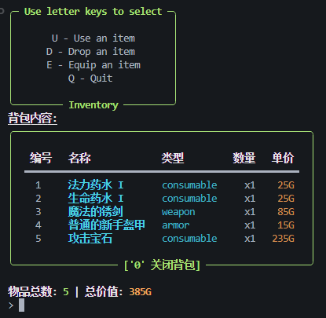
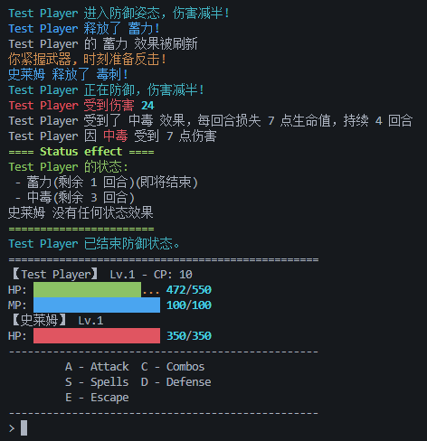

# Text RPG Game

[](https://deepwiki.com/KeJWS/test_rpg_game)

`Text RPG Game` 是一个基于 Python 实现的简单文字角色扮演游戏（RPG）框架，支持角色扮演、回合制战斗、技能释放、物品管理等核心游戏机制。该项目旨在为开发者提供一个易于扩展和定制的游戏基础框架，方便学习和二次开发。

## 项目特点

- **回合制战斗系统**  
  支持普通攻击、暴击、防御、技能使用以及逃跑等操作。实现了伤害计算、暴击倍率、技能效果等战斗逻辑，带来丰富的战斗体验。

- **角色管理**  
  包括玩家和敌人角色的定义，支持不同角色属性的扩展。提供基础的生命值、攻击力、防御力、暴击率等属性管理。

- **技能系统**  
  支持通过技能释放特殊攻击，包含多种技能效果处理逻辑，增强战斗策略性。

- **物品与装备系统**  
  支持多种物品和装备，玩家可通过拾取和使用物品提升战斗能力。

- **事件系统**  
  支持游戏内事件触发，丰富游戏剧情和交互。
## 开源协议

本项目采用 [MIT 许可证](./LICENSE) 进行开源。选择该协议的理由如下：

- MIT 许可证是一种非常宽松的开源协议，允许任何人自由使用、复制、修改、合并、发布、分发、再授权和销售软件。
- 只需保留原始版权声明和许可声明，便于代码的使用、修改和分发。
- 适合希望最大限度开放代码，促进社区贡献和二次开发的项目。
- 该协议明确声明软件按“现状”提供，不提供任何明示或暗示的保证，作者不承担任何责任。

详细条款请参见项目根目录下的 LICENSE 文件。

## 文件结构

- `combat.py`  
  实现主要的战斗逻辑。

- `ui/text.py`  
  提供战斗菜单和技能菜单的文本输出功能。

- `skills.py`  
  包含技能的定义及其效果实现。

- `core/battler.py`  
  战斗相关核心类的实现。

- `enemies.py`  
  敌人角色定义及相关逻辑。

- `player.py`  
  玩家角色定义及相关逻辑。

- `events.py`  
  游戏事件相关实现。

- `items.py`  
  物品、武具、消耗品实例定义。

- `img/`  
  游戏图片文件夹，包含装备图片和截图。

- `data/`  
  游戏数据文件，如 CSV、JSON 格式的配置数据。

- `extensions/`  
  扩展功能模块。

- `inventory/`  
  物品栏相关代码。

- `core/`  
  核心游戏机制代码。

- `ui/`  
  用户界面相关代码。

- `world/`  
  游戏世界地图及任务相关代码。

## 安装步骤

1. 克隆仓库：
   ```bash
   git clone https://github.com/KeJWS/test_rpg_game.git
   cd test_rpg_game
   ```

2. 安装 Python 3.12 或更高版本，确保已配置好环境变量。

3. （可选）建议创建虚拟环境：
   ```bash
   python -m venv venv
   source venv/bin/activate  # Linux/macOS
   venv\Scripts\activate     # Windows
   ```

4. 安装依赖：
   ```bash
   pip install -r requirements.txt
   ```

## 使用方法

1. 运行主程序：
   ```bash
   python game.py
   ```

2. 根据游戏提示进行操作，支持以下主要指令：
   - 普通攻击
   - 使用技能
   - 防御
   - 逃跑

3. 游戏通过回合制战斗系统进行，玩家与敌人轮流行动，合理使用技能以获得胜利。

## 功能说明

- **战斗系统**  
  支持多种战斗操作，包含伤害计算、暴击判定、技能效果等。

- **角色属性**  
  玩家和敌人拥有生命值、攻击力、防御力、暴击率等属性，影响战斗表现。

- **技能系统**  
  多样化技能设计，支持不同效果的技能释放。

- **物品系统**  
  支持装备和消耗品，提升角色能力或恢复状态。

- **事件系统**  
  触发游戏内事件，推动剧情发展。

## 截图预览

  
  
  
  
  

## 贡献指南

欢迎贡献代码或提出建议！请提交 Pull Request 或创建 Issue。