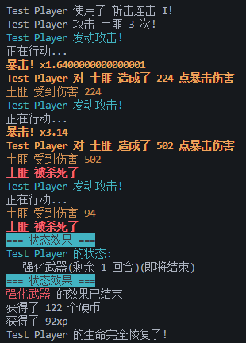
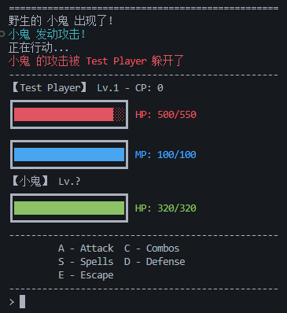
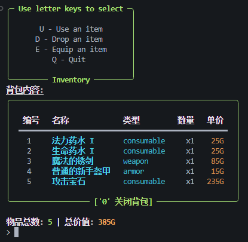
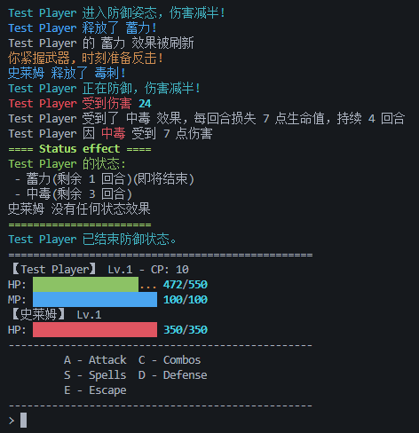

# Text RPG Game

`Text RPG Game` 是一个基于 Python 实现的简单 RPG 游戏框架，支持角色扮演、战斗系统、技能使用等核心游戏机制。

## 项目特点

- **回合制战斗系统**：
  - 支持普通攻击、暴击、防御、技能使用以及逃跑等操作。
  - 实现了伤害计算、暴击倍率、技能效果等的战斗逻辑。

- **角色管理**：
  - 包括玩家和敌人角色的定义，支持不同角色属性的扩展。
  - 提供基础的角色生命值、攻击力、防御力、暴击率等属性。

- **技能系统**：
  - 支持通过技能释放特殊攻击。
  - 包含技能效果处理逻辑。

## 文件结构

### `combat.py`
- 实现了主要的战斗逻辑。

### `ui/text.py`
- 提供战斗菜单和技能菜单的文本输出功能。

### `skills.py`
- 包含技能的定义及其效果实现。

### `core/battler.py`
- 实现了主要的战斗逻辑。

### `enemies.py`
- 敌人相关。

### `player.py`
- 玩家相关。

### `events.py`
- 事件相关。

### `items.py`
- 物品，武具，消耗品实例。

## 快速开始

1. 克隆仓库：
   ```bash
   git clone https://github.com/KeJWS/test_rpg_game.git
   cd test_rpg_game

2. 建议安装 Python 3.12 或更高版本。

3. 运行主程序：
   ```bash
   python game.py

4. 根据提示选择操作，体验回合制战斗。

## 截图预览










## 贡献指南

欢迎贡献代码或提出建议！请提交 Pull Request 或创建 Issue。