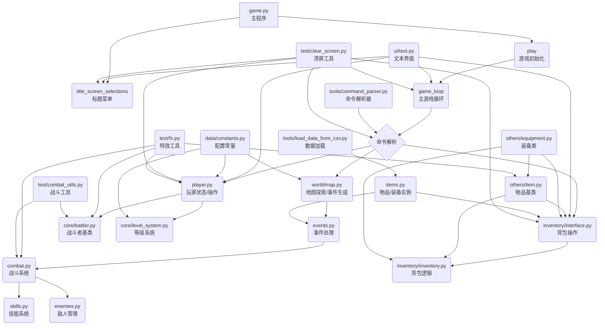

# Text RPG Game 综合说明文档（旧）

## 1. 引言

`Text RPG Game` 是一个基于 Python 实现的文本角色扮演游戏（RPG）框架。该项目旨在提供一个简单而灵活的游戏系统，支持回合制战斗、角色管理、技能使用、物品装备、地图探索等核心游戏机制。本文档面向开发者和玩家，详细介绍项目的功能特性、技术架构、安装部署、配置方法、使用指南、API说明及常见问题，帮助用户快速上手和深入理解项目。

## 2. 项目概述与功能特性

### 2.1 项目简介

`Text RPG Game` 是一个纯文本交互的 RPG 游戏，玩家通过命令行界面进行游戏操作。游戏支持角色成长、装备管理、技能释放、随机事件触发等多样玩法，适合喜欢经典文字冒险和策略战斗的玩家。

### 2.2 核心功能

- **回合制战斗系统**  
  支持普通攻击、暴击、防御、技能使用和逃跑等操作。实现了详细的伤害计算、暴击倍率和技能效果。

- **角色管理**  
  包括玩家和敌人角色定义，支持多种属性如生命值、攻击力、防御力、暴击率等，角色可升级和转生。

- **技能系统**  
  支持多样技能释放，包含技能效果处理逻辑，丰富战斗策略。

- **物品与装备**  
  多种物品类型，包括武器、防具、消耗品等，支持装备穿戴和属性加成。

- **背包系统**  
  方便的物品管理界面，支持查看、使用、丢弃和装备物品。

- **地图与事件**  
  支持地图探索，随机触发战斗、商店和治疗事件，增强游戏趣味性。

- **调试模式**  
  提供调试开关，方便开发和测试。

## 3. 技术架构

### 3.1 项目文件结构概览

项目采用模块化设计，主要文件和目录包括：

- `game.py`：主程序入口，控制游戏流程和菜单。
- `combat.py`：战斗系统核心逻辑。
- `player.py`：玩家角色管理。
- `enemies.py`：敌人数据和行为。
- `skills.py`：技能定义及效果实现。
- `items.py`：物品和装备实例。
- `inventory/`：背包管理相关模块。
- `world/`：地图和事件相关模块。
- `tools/`：辅助工具，如命令解析等。
- `ui/`：文本界面显示。
- `data/`：配置数据和常量。
- `core/`：核心战斗者和等级系统。
- `others/`：物品和装备基类。
- `extensions/`：游戏扩展功能。
- `test/`：测试和辅助脚本。

### 3.2 主要模块职责

- `game.py`：游戏主循环和菜单交互。
- `combat.py`：实现战斗回合逻辑和伤害计算。
- `player.py`：管理玩家属性、状态和操作。
- `enemies.py`：定义敌人属性和行为。
- `skills.py`：技能释放和效果处理。
- `inventory/`：物品管理和装备操作。
- `world/`：地图生成和事件触发。
- `ui/text.py`：文本界面输出。
- `data/constants.py`：游戏配置常量。
- `core/battler.py`：战斗者基类。
- `core/level_system.py`：角色等级和经验系统。

### 3.3 使用的主要技术和库

- Python 3.12+
- `rich`：用于美化命令行文本界面。
- `ascii_magic`：用于生成 ASCII 艺术（装备显示）。
- CSV 和 JSON 文件用于数据存储和加载。

### 3.4 数据存储方式

- 游戏数据主要存储在 `data/csv_data/` 和 `data/json_data/` 目录下的 CSV 和 JSON 文件中。

### 3.5 技术架构图



## 4. 安装与部署

### 4.1 环境要求

- Python 3.12 或更高版本。

### 4.2 获取项目代码

```bash
git clone https://github.com/KeJWS/test_rpg_game.git
cd test_rpg_game
```

### 4.3 安装依赖

本项目依赖以下第三方库：

- `rich`
- `ascii_magic`

使用 pip 安装：

```bash
pip install rich ascii_magic
```

### 4.4 运行项目

在项目根目录下执行：

```bash
python game.py
```

即可启动游戏主程序。

## 5. 配置指南

### 5.1 配置文件介绍

项目的主要配置项集中在 `data/constants.py` 文件中，包含游戏的倍率设置、调试开关、物品品质配置、敌人变种等。

### 5.2 主要配置项说明

- `MONEY_MULTIPLIER`：游戏中金钱的倍率，默认为 1。
- `EXPERIENCE_RATE`：经验获取倍率，默认为 1。
- `DEBUG`：调试模式开关，开启后会显示更多调试信息。
- `QUALITY_CONFIG`：物品品质配置，包含品质名称、价格倍率、属性倍率和权重。
- `DEFAULT_EQUIPMENT_IMAGES`：默认装备图片路径映射。
- `ENEMY_VARIANTS`：敌人变种配置，定义不同变种的属性倍率和奖励倍率。
- `POSSIBLE_ENEMIES`：游戏中可能出现的敌人及其等级范围。

### 5.3 修改配置

直接编辑 `data/constants.py` 文件中的对应变量即可调整游戏参数。修改后保存，重新运行游戏生效。

## 6. 使用方法

### 6.1 游戏启动与主菜单

启动游戏后，进入标题菜单，提供以下选项：

- 1：开始新游戏
- 2：查看帮助菜单
- 3：退出游戏

通过输入对应数字选择操作。

### 6.2 游戏主循环操作

游戏主循环中，玩家可通过以下命令进行操作：

- `w`：探索地图，随机触发战斗、商店或治疗事件。
- `s`：查看角色状态。
- `a`：分配天赋点。
- `i`：打开背包，管理物品。
- `m`：查看地图信息。
- `q`：查看所有任务。
- `q`（主菜单）：退出游戏。

### 6.3 战斗系统

战斗为回合制，玩家可选择：

- 普通攻击
- 使用技能
- 防御
- 逃跑

战斗中会显示详细的伤害计算和状态变化。

### 6.4 背包管理

背包界面支持：

- 查看物品列表
- 使用消耗品
- 装备武器和防具
- 丢弃物品
- 比较装备属性

## 7. API 接口说明

本项目为命令行游戏，无对外 API 接口。内部模块通过函数调用和事件机制交互。

## 8. 常见问题与故障排除

- **依赖未安装**：请确保已安装 `rich` 和 `ascii_magic`，使用 `pip install` 安装。
- **文件缺失**：确保项目文件完整，尤其是 `data/` 目录下的数据文件。
- **调试信息**：开启 `data/constants.py` 中的 `DEBUG` 选项以获取详细日志。
- **游戏异常退出**：检查 Python 版本是否符合要求，建议使用 3.12 及以上。

## 9. 贡献指南

欢迎贡献代码或提出建议！请提交 Pull Request 或创建 Issue。

## 10. 许可证

请参考项目根目录中的许可证文件（如有）了解详细信息。